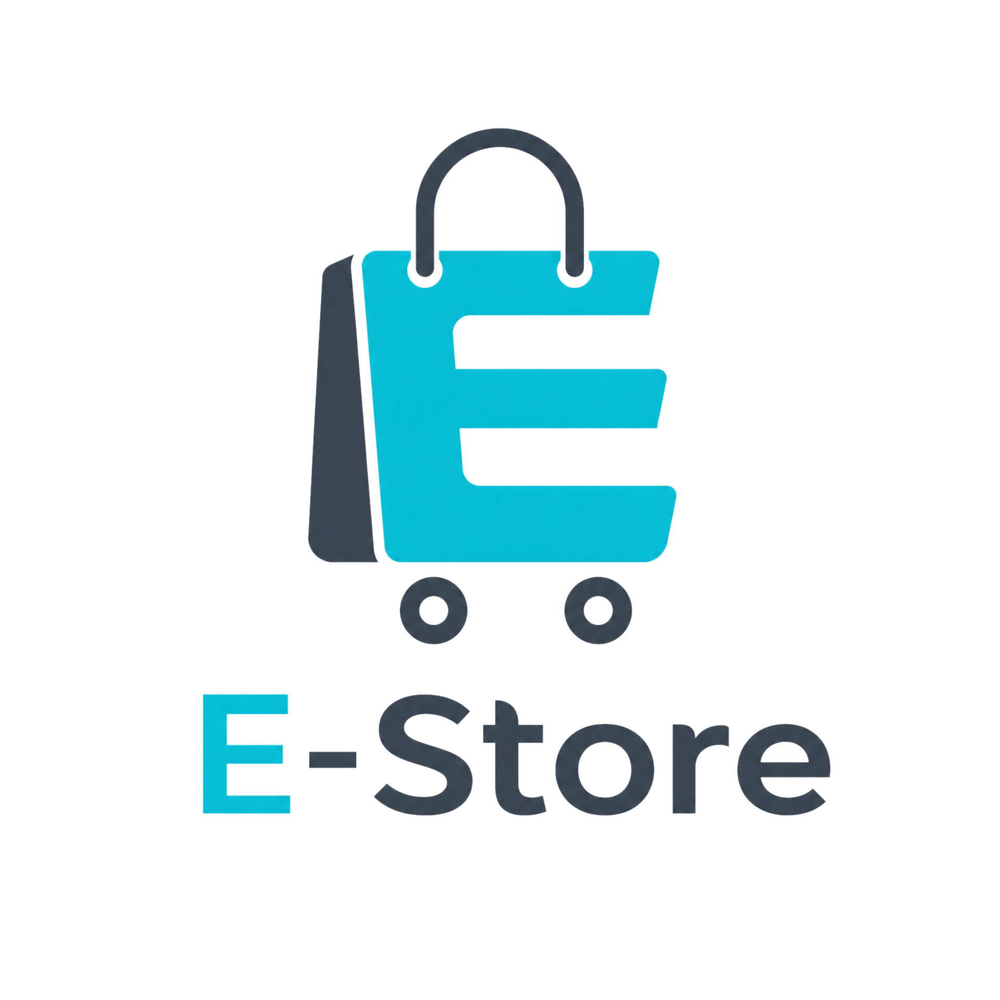
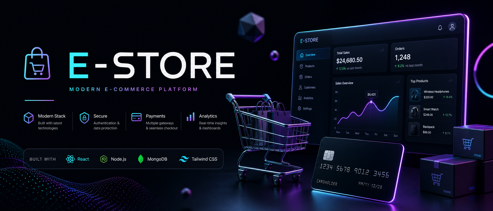

<div align="center">



# E-Store: Full-Stack MERN E-Commerce Platform



**A high-performance, feature-rich, and secure full-stack e-commerce web application built with the MERN stack (MongoDB, Express, React, Node.js), Redis caching, Stripe payment gateway, and Tailwind CSS.**

[Key Features](#-key-features) • [Tech Stack](#-tech-stack) • [Architecture](#-architecture--project-structure) • [Getting Started](#-getting-started) • [Environment Variables](#-environment-variables) • [API Documentation](#-api-documentation) • [License](#-license)

</div>

---

## 🌟 Overview

**E-Store** is an enterprise-grade e-commerce platform engineered to deliver seamless shopping experiences, lightning-fast product filtering and caching, secure user authentication, and robust administrative control. Designed with modern architectural patterns, it integrates industry-leading tools such as **Stripe** for payment processing, **Cloudinary** for cloud media asset management, **Redis** for high-speed caching and coupon verification, and **Zustand** for predictable state management.

Whether you are browsing curated fashion categories, applying real-time promotional discount coupons, managing a cart with dynamic quantity updates, or monitoring sales analytics through an admin dashboard, **E-Store** provides a polished, responsive, and secure environment.

---

## 📸 Platform Showcase

| Storefront & Categories | Admin Analytics Dashboard |
| :---: | :---: |
|  |  |
| *Intuitive homepage featuring curated categories, featured products, and responsive navigation.* | *Comprehensive analytics tab providing real-time sales metrics and trends.* |

---

## ✨ Key Features

### 🛍️ Customer Experience & Shopping
- **Dynamic Category Filtering**: Explore curated collections including Jeans, T-shirts, Shoes, Jackets, Suits, Glasses, Bags, and more.
- **Advanced Cart & Order Summary**: Real-time quantity adjustments, price calculations, and item management powered by Zustand.
- **Interactive Checkout & Payments**: Secure checkout powered by **Stripe API**, complete with success and cancellation redirection handlers.
- **Smart Coupon System**: Apply promotional discount codes validated through high-speed Redis caching.
- **"People Also Bought" Recommendations**: Intelligent cross-selling suggestions to enhance user engagement and average order value.

### 🛡️ Security & Authentication
- **JWT Authentication with Refresh Tokens**: Secure cookie-based authentication with JSON Web Tokens protecting sensitive endpoints.
- **Password Hashing**: Industry-standard cryptographic hashing using `bcryptjs`.
- **Protected Routes & Role-Based Access**: Strict separation between customer storefronts and restricted administrator panels.

### 📊 Administrator Dashboard
- **Product Management**: Create, view, and delete products with image uploads directly handled via **Cloudinary**.
- **Featured Product Control**: Toggle featured status on products to highlight promotional items across the storefront.
- **Sales Analytics & Visualizations**: Real-time business intelligence metrics including total users, total products, total sales, and revenue tracking powered by **Recharts**.

---

## 🛠️ Tech Stack

The application is architected using a decoupled client-server model, utilizing cutting-edge web development technologies.

### **Frontend**
- **Core Library**: **React 19** with **Vite** for blazing-fast development and hot module replacement.
- **Styling**: **Tailwind CSS v4** for utility-first, fully responsive design.
- **State Management**: **Zustand** for lightweight and scalable global state stores.
- **Routing**: **React Router v7** for seamless client-side page transitions.
- **UI & Animations**: **Lucide React** icons, **Framer Motion** for fluid animations, **React Hot Toast** for notifications, and **Recharts** for data visualization.

### **Backend**
- **Runtime & Framework**: **Node.js** with **Express 5** RESTful API architecture.
- **Database**: **MongoDB & Mongoose ODM** for robust NoSQL data modeling and persistence.
- **Caching & Session Management**: **Redis (ioredis)** for lightning-fast token blacklisting and session optimization.
- **Payment Processing**: **Stripe Node SDK** for secure payment intents and webhook handling.
- **Media Storage**: **Cloudinary SDK** for secure cloud image uploading and optimization.

---

## 📂 Architecture & Project Structure

The project follows a clean, modular directory structure ensuring high maintainability and scalability across the client and server codebases.

```text
E-commerce-store/
├── backend/
│   ├── controllers/      # Business logic handlers (auth, cart, coupon, payment, product, analytics)
│   ├── db/               # Database connection configuration (MongoDB)
│   ├── lib/              # Third-party integrations (Cloudinary, Redis, Stripe)
│   ├── middlewares/      # Custom authentication and authorization middleware
│   ├── models/           # Mongoose schemas (User, Product, Order, Coupon)
│   ├── routes/           # Express API route endpoints
│   ├── utils/            # Helper utilities (JWT generation)
│   └── server.js         # Application entry point and server setup
├── frontend/
│   ├── public/           # Static assets, fallback images, and screenshots
│   ├── src/
│   │   ├── components/   # Modular UI components (Admin, Cart, Common, Products)
│   │   ├── lib/          # Axios HTTP client configuration
│   │   ├── pages/        # View components (Admin, Cart, Home, Login, Signup, etc.)
│   │   ├── stores/       # Zustand state stores (cart, product, user)
│   │   ├── App.jsx       # Root component and router configuration
│   │   └── main.jsx      # React DOM hydration entry point
│   ├── package.json      # Frontend dependencies and scripts
│   └── vite.config.js    # Vite build and development configuration
├── package.json          # Root dependencies and build scripts
└── README.md             # Project documentation
```

---

## 🚀 Getting Started

Follow these instructions to set up and run the project locally on your machine.

### Prerequisites
- **Node.js** (v18 or higher recommended)
- **MongoDB** instance (local or Atlas cluster)
- **Redis** server (local or cloud instance)
- **Stripe** account (for payment gateway integration)
- **Cloudinary** account (for media uploads)

### 1. Clone the Repository
```bash
git clone https://github.com/aihamjassar/E-commerce-store.git
cd E-commerce-store
```

### 2. Install Dependencies
Install root and frontend dependencies concurrently or separately:
```bash
# Install root (backend) dependencies
npm install

# Install frontend dependencies
cd frontend
npm install
cd ..
```

### 3. Configure Environment Variables
Create a `.env` file in the root directory (`backend/.env` or root depending on your local config loader) and configure the required environment variables:

```env
PORT=5000
MONGODB_URI=your_mongodb_connection_string
REDIS_URL=your_redis_connection_string
PORT=5000
NODE_ENV=development

ACCESS_TOKEN_SECRET=your_jwt_access_token_secret
REFRESH_TOKEN_SECRET=your_jwt_refresh_token_secret

STRIPE_SECRET_KEY=your_stripe_secret_key

CLOUDINARY_CLOUD_NAME=your_cloudinary_cloud_name
CLOUDINARY_API_KEY=your_cloudinary_api_key
CLOUDINARY_API_SECRET=your_cloudinary_api_secret
CLIENT_URL=http://localhost:5173
```

### 4. Running the Application

#### Development Mode
Run the backend server with `nodemon` (auto-reload):
```bash
npm run dev
```

In a separate terminal, start the frontend Vite development server:
```bash
cd frontend
npm run dev
```

Open your browser and navigate to `http://localhost:5173`.

#### Production Build
To build both frontend and backend for production deployment:
```bash
npm run build
npm start
```

---

## 🔌 API Endpoints Summary

| Method | Endpoint | Description | Access |
| :--- | :--- | :--- | :--- |
| **POST** | `/api/auth/signup` | Register a new user account | Public |
| **POST** | `/api/auth/login` | Authenticate user & issue tokens | Public |
| **POST** | `/api/auth/logout` | Terminate user session | Private |
| **GET** | `/api/products` | Retrieve all active products | Public |
| **GET** | `/api/products/featured` | Retrieve featured products | Public |
| **POST** | `/api/products` | Create a new product | Admin |
| **DELETE** | `/api/products/:id` | Delete a product | Admin |
| **GET** | `/api/carts` | Get current user's cart items | Private |
| **POST** | `/api/carts` | Add item to cart | Private |
| **POST** | `/api/payments/create-checkout-session` | Create Stripe checkout session | Private |
| **GET** | `/api/analytics` | Retrieve store sales analytics | Admin |

---

## 🤝 Contributing

Contributions are welcome! Please follow these steps to contribute:
1. Fork the repository.
2. Create your feature branch (`git checkout -b feature/AmazingFeature`).
3. Commit your changes (`git commit -m 'Add some AmazingFeature'`).
4. Push to the branch (`git push origin feature/AmazingFeature`).
5. Open a Pull Request.

---

## 📄 License

Distributed under the **ISC License**. See `LICENSE` for more information.

---

<div align="center">
  <p>Built with ❤️ by <a href="https://github.com/aihamjassar">Aiham Jassar</a></p>
</div>
